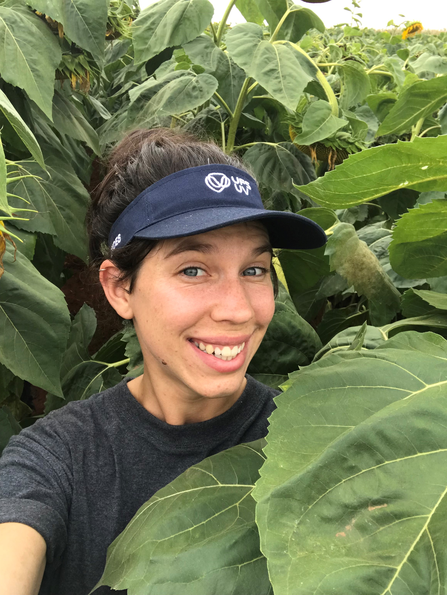

I completed my PhD in Plant Pathology, at the [University of the Free State (UFS)](https://www.ufs.ac.za/homepage), South Africa. My research focused on soybean and sunflower stem and head rot, caused by _Sclerotinia sclerotiorum_, distribution and potential climatic predictors. I was under the supervision of Professor Neal McLaren (UFS) and Professor [Emerson Del Ponte](https://github.com/emdelponte), [Universidade Federal de Viçosa (UFV)](https://www.ufv.br/international-students/), in Brazil. 

I am currently a Lecturer, teaching an Introductory Plant Pathology course as well as an honours course, an Introduction to Plant Disease Epidemiology at the UFS. I am the Principle Investigator in my division for Plant Disease Epidemiology, our group currently consists of  six postgraduate students, 2 Hons, 2 MSc and 2 PhD students. Our research group focuses on Sclerotinia diseases of oilseed and -protein crops, sorghum foliar and grain diseases, as well as fungicide resistance. I enjoy doing the data science components of my research and getting out into the fresh air to conduct our field trials.   

I have taught myself how to use R and R-studio, under the guidance of my co-supervisor and lab mates at the UFV. I am encouraging the post-graduates in our group to do the same. I provide them with guidance but promote self-learning as this is a heuristic process.  

Outside of my academic work, I am also the Blog and Social Media Editor for [Open Plant Pathology](https://openplantpathology.org/).  I am passionate about Open Science and Reproducible Research.  This year, I also started as an Assistant Editor at [_Phytopathology_](https://apsjournals.apsnet.org/journal/phyto). 

You can find my full CV [here](files/LisaAnnRothmann_CV.pdf). 

