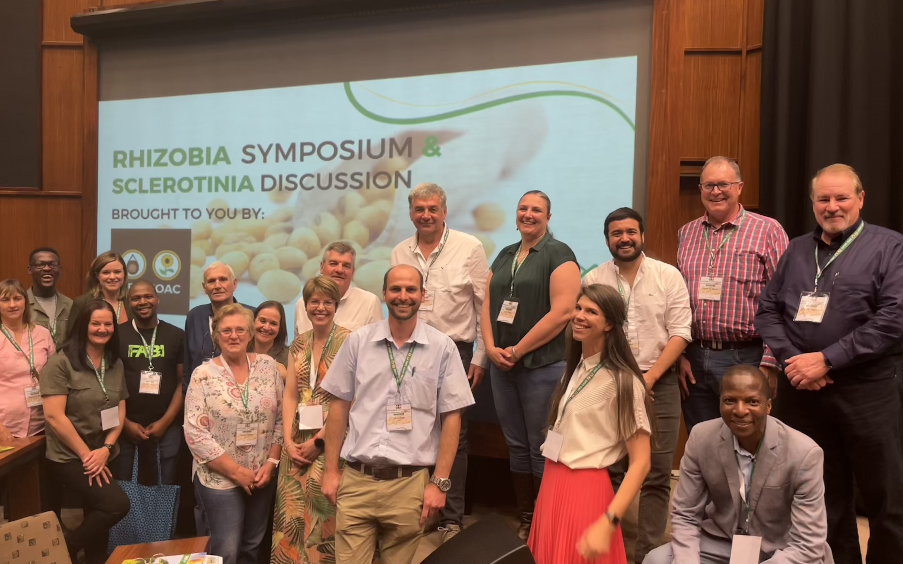

# Welcome, this is my storyboard...  

#### 09-September-2022

I will be sharing my experiences and journal as an early career academic, I hope to use this platform as a reflective practice for myself, motivation for days that I feel things are not as I planned and encouragement for others.  

#### Rhizobia symposium and _Sclerotinia_ discussion

This past week I spoke at the Rhizobia symposium and _Sclerotinia_ discussion hosted at the CSIR Convention Centre, in Pretoria. This event is one of my annual highlights because it brings producers (farmers), industry, government and academia together. I appreciate all the efforts the Oil & Protein Seeds Development Trust (OPDT) and Oilseeds Advisory Committee (OAC) team make to facilitate an engaging programme and fruitful discussions. 

I presented the development, progress and engagements of a community of practice I initiated in 2017 with the support of my supervisor, Professor Neal McLaren, and friend, Marlese Meiring. You can view the slides presented on the Open Science Framework platform: https://osf.io/k52cj/

----

